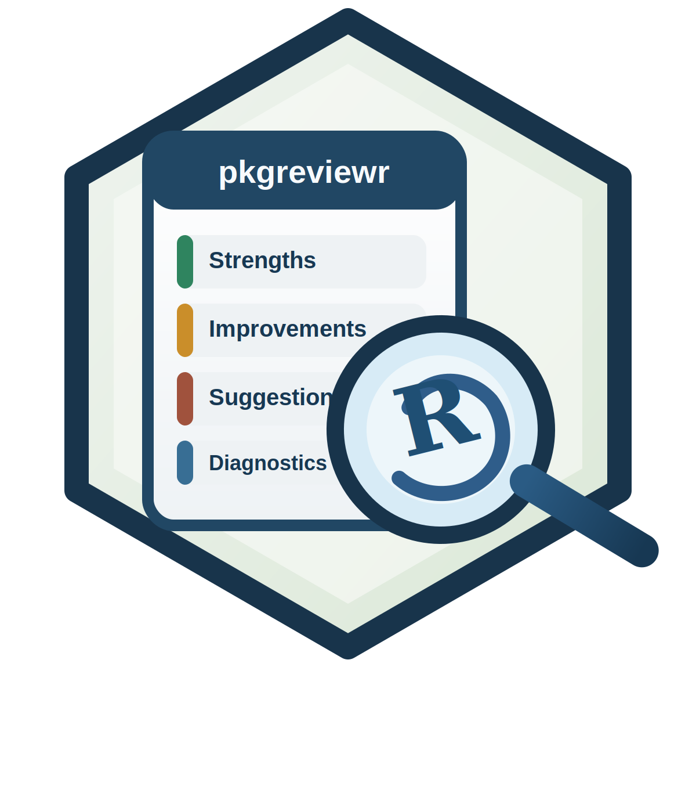

# pkgreviewr

`pkgreviewr` reviews R packages with a section-based workflow. It gathers
deterministic QA signals locally, builds targeted context for each review
section, asks an LLM for concise section outputs, synthesizes an overall
diagnostic from section summaries, and can persist intermediate artifacts for
debugging.

The current stable user-facing entry points are:

- `collect_review_data()` for deterministic signal collection
- `build_report()` for end-to-end report generation

Project website: <https://alekoure.github.io/pkgreviewr/>

## Installation

```r
pak::pak("AleKoure/pkgreviewr")
```

## Quick Start

Use a custom backend function when you want to manage provider integration
yourself:

```r
library(pkgreviewr)

my_chat_fn <- function(system_prompt, user_prompt) {
  stop("Connect your preferred chat backend here")
}

build_report(
  "https://github.com/dvdscripter/ini",
  chat_fn = my_chat_fn
)
```

Use an `ellmer` chat object when you want a ready-made provider client. The
`ellmer` reference for constructing chat objects is at
<https://ellmer.tidyverse.org>.

```r
library(ellmer)
library(pkgreviewr)

chat <- chat_openai(model = "gpt-4.1-mini")

build_report(
  "https://github.com/dvdscripter/ini",
  chat = chat
)
```

Use a local Ollama backend by setting a model name before calling
`build_report()`:

```sh
export PKGREVIEWR_OLLAMA_MODEL=llama3.2
```

## What `build_report()` Does

`build_report()` currently:

- clones the target package repository
- installs dependencies into an isolated library path
- runs local QA collection in a subprocess
- generates review sections independently
- stores a concise summary for each section
- synthesizes an overall assessment from section summaries
- optionally writes prompts, traces, and reports to `artifact_dir`

The returned object is a `pkgreviewr_report` character vector with attributes
for draft output, section results, traces, provenance, and persisted artifact
location.

## Collecting Data Only

Inspect deterministic evidence without generating a report:

```r
library(pkgreviewr)

review_data <- collect_review_data("https://github.com/dvdscripter/ini")
```

Collected signals currently include:

- `devtools::check()` output
- `lintr::lint_package()` output
- `covr::package_coverage()` output
- extracted package code from `rdocdump`
- recorded session information

## Advanced Usage

For advanced backend setup, parallel section generation, and artifact
persistence, see the vignette:

```r
vignette("advanced-usage", package = "pkgreviewr")
```

An example generated report is available at [test_review.md](./test_review.md).
